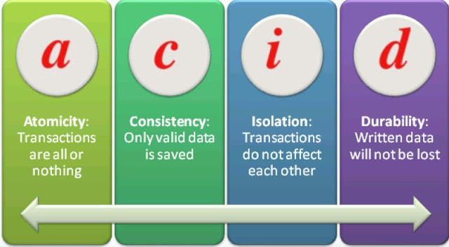
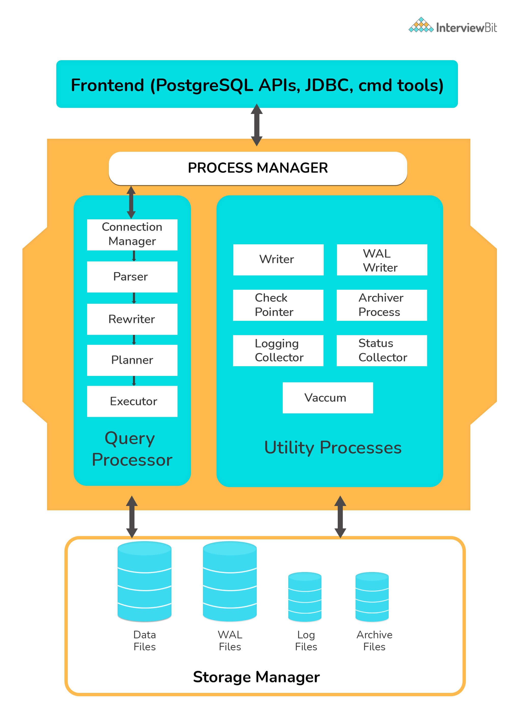
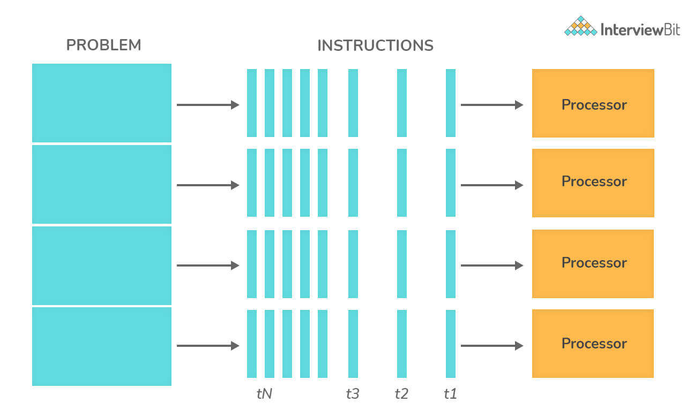

# Câu hỏi phỏng vấn PostgreSQL


## PostgreSQL là gì?

PostgreSQL là một hệ thống quản trị cơ sở dữ liệu quan hệ và đối tượng (object-relational database management system) miễn phí và nguồn mở (RDBMS) tiên tiến nhất hiện nay, khả năng mở rộng cao và tuân thủ các tiêu chuẩn kỹ thuật. Nó được thiết kế để xử lý một loạt các khối lượng công việc lớn, từ các máy tính cá nhân đến kho dữ liệu hoặc dịch vụ Web có nhiều người dùng đồng thời.

PostgreSQL được phát triển dựa trên POSTGRES 4.2 tại phòng khoa học máy tính Berkeley, Đại học California.

PostgreSQL được thiết kế để chạy trên các nền tảng tương tự UNIX. Tuy nhiên, PostgreSQL sau đó cũng được điều chỉnh linh động để có thể chạy được trên nhiều nền tảng khác nhau như Mac OS X, Solaris và Windows.

PostgreSQL là một phần mềm mã nguồn mở miễn phí. Mã nguồn của phần mềm khả dụng theo license của PostgreSQL, một license nguồn mở tự do. Theo đó, bạn sẽ được tự do sử dụng, sửa đổi và phân phối PostgreSQL dưới mọi hình thức.

PostgreSQL không yêu cầu quá nhiều công tác bảo trì bởi có tính ổn định cao. Do đó, nếu bạn phát triển các ứng dụng dựa trên PostgreSQL, chi phí sở hữu sẽ thấp hơn so với các hệ thống quản trị dữ liệu khác.

## Câu hỏi phỏng vấn PostgreSQL cho Fresher

### 1. Các tính năng trong PostgreSQL?

- Toàn vẹn dữ liệu: Là ràng buộc loại từ, khóa khuyến nghị, Primary Keys, Foreign Keys,…
- Kiểu dữ liệu: cấu trúc, nguyên hàm, hình học và tùy chỉnh
- Hiệu suất, đồng quy: Những tính năng lập danh mục, lập danh mục nâng cao và trình lập kế hoạch,…chúng đều được thực hiện một cách tự động.
- Các chức năng bảo mật: Bảo mật, xác thực, hệ thống kiểm soát truy cập mạnh mẽ, bảo mật cấp độ cột và hàng.
- Khả năng tìm kiếm văn bản: Tìm kiếm đầy đủ những văn bản, hệ thống bao gồm các kỳ tự quốc tế thông qua ICU collations.
- Khả năng mở rộng: PostgreSQL có phương pháp lưu trữ, ngôn ngữ thủ tục, tính năng kết nối cơ sở dữ liệu hoặc luồng khác với giao diện SQL chuẩn cùng với nhiều tính năng mở rộng vượt trội khác.

### 2. Multi-version Concurrency Control trong Postgres là gì?

Một trong những tính năng nổi bật của Postgres đó là cách mà nó thực hiện điều khiển tương tranh giữa các transaction, nghĩa là read sẽ không bao giờ chặn write và ngược lại. Nói một cách dễ hình dung hơn, nếu hai transaction thực thi cùng một lúc thì nguyên tắc thực thi là thực thi độc lập, Postgres thực hiện được điều này là nhờ một cơ chế gọi là Multi Version Concurrency Control (MVCC)

### 3. Làm thế nào để đánh chỉ mục trong Postgres?

Chỉ mục (Indexex) là các hàm có sẵn trong Postgres được sử dụng cho các truy vấn tìm kiếm để đạt hiệu quả cao hơn đối với một bảng trong cơ sở dữ liệu. Giả sữ rằng bạn có một bảng với hàng ngìn bản ghi và câu truy vấn của bạn thì chỉ có vài bản ghi là phù hợp với điều kiện, như vậy sẽ mất rất nhiều thời gian để tìm và trả về nững hàng thoả mã điều kiện này vì nó phải thực hiện hoạt động tìm kiếm trên từng hàng đơn lẻ. Điều này chắc chẵn không hiệu quả đối với một hệ thống xử lý dữ liệu khổng lồ. Bây giờ nếu hệ thống này có một chỉ mục trên cột mà chúng tôi đang áp dụng tìm kiếm, nó có thể sử dụng một phương pháp hiệu quả để xác định các hàng phù hợp bằng cách chỉ đi qua một vài cấp độ. Đây được gọi là lập chỉ mục (indexing).

```sql
SELECT * FROM some_table WHERE table_col=120
```

### 4. Làm thế nào để thay đổi kiểu dữ liệu của cột?

Có thể sử dụng lệnh ALTER TABLE như bên dưới

```sql
ALTER TABLE tname
ALTER COLUMN col_name [SET DATA] TYPE new_data_type;
```

### 5. Lệnh dùng cho tạo cơ sở dữ liệu trong Postgres?

Cú pháp tạo cơ sở dữ liệu trong Postgres trong psql là:

```sql
CREATE DATABASE db_name;
```

### 6. Cách để khởi động, dừng và khởi động lại trong PostgreSQL Server?

- Để khởi động Postgres server:

```text
service postgresql start
```

- Sau khi server khởi động thành công, sẽ có thông báo như sau:

```text
Starting PostgreSQL: ok
```

- Để khởi động lại Postgres server:

```text
service postgresql restart
```

- Nếu khởi động lại thành công:

```text
Restarting PostgreSQL: server stopped
ok
```

- Để dừng server, ta chạy lệnh:

```text
service postgresql stop
```

- Nếu dừng thành công:

```text
Stopping PostgreSQL: server stopped
ok
```

### 7. Các kiểu partioned table?

Partitioned table là một cấu trúc logic được dùng cho chia một bảng lớn thành các cấu trúc nhỏ hơn gọi là partition. Cách tiếp cận này được dùng để tăng hiệu suất truy vấn khi làm việc với bảng cơ sở dữ liệu lớn. Để tạo một partition, một khoá gọi là khoá phân vùng được dùng cho các cột hoặc biểu thức, và một phương thức phân vùng cần định nghĩa. Có 3 kiểu phương thức phân vùng có sẵn được cung cấp bởi Postgres:

- **Range Partitioning**: Phương pháp này được thực hiện bằng cách phân vùng dựa trên một loạt các giá trị. Phương pháp này được sử dụng phổ biến nhất dựa trên các trường ngày tháng để lấy dữ liệu hàng tháng, hàng tuần hoặc hàng năm. Trong trường hợp như giá trị thuộc phần cuối của phạm vi, ví dụ: nếu phạm vi của phân vùng 1 là 10-20 và phạm vi của phân vùng 2 là 20-30 và giá trị đã cho là 10, thì 10 thuộc về đến phân vùng thứ hai chứ không phải phân vùng đầu tiên.
- **List Partitioning**: Phương pháp này được sử dụng để phân vùng dựa trên danh sách các giá trị đã biết. Thường được sử dụng nhất khi chúng ta có key có giá trị phân loại. Ví dụ: nhận dữ liệu bán hàng dựa trên các khu vực được chia thành quốc gia, thành phố hoặc tiểu bang.
- **Hash Partitioning**: Phương pháp này sử dụng một hàm băm trên khoá phân vùng. Điều này được thực hiện khi không có yêu cầu cụ thể nào đối với việc phân chia dữ liệu và được sử dụng để truy cập dữ liệu riêng lẻ. Ví dụ: bạn muốn truy cập dữ liệu dựa trên một sản phẩm cụ thể, thì việc sử dụng phân vùng băm sẽ dẫn đến tập dữ liệu đã yêu cầu.

Loại khoá phân vùng và loại phương pháp được sử dụng để phân vùng xác định mức độ tích cực của hiệu suất và mức độ quản lý của bảng được phân vùng.

### 8. Token trong Postgres?

Token trong Postgres là một từ khoá, tên định danh, hằng, hay bất kỳ ký hiệu nào cho tính riêng biệt. Nó có thể được phân chia (hoặc không) bằng khoảng trắng, tab hay xuống dòng. Nếu token là từ khoá, nó thường là một lệnh hữu ích. Token có thể được tạo bằng bất kỳ code PostgreSQL nào.

### 9. Câu lệnh TRUNCATE là gì?

Lệnh TRUNCATE TABLE name_of_table xoá dữ liệu một cách hiệu quả và nhanh chóng khỏi bảng.

```sql
TRUNCATE TABLE name_of_table
RESTART IDENTITY;
```

Ta còn có thể dùng lệnh cho xoá nhiều bảng cùng lúc như sau:

```sql
TRUNCATE TABLE
   table_1,
   table_2,
   table_3;
```

### 10. Dung lượng của một bảng trong Postgres?

Kích cỡ lớn nhất cho một bản là 32TB.

### 11. Sequence trong Postgres?

Sequence là một đối tượng dữ liệu trong PostgreSQL, được sử dụng để tạo ra chuỗi các số tự nhiên (integer) theo 1 quy tắc nhất định. Để tạo 1 Sequece chúng ta sử dụng câu lệnh SQL là: `CREATE SEQUENCE`

```sql
CREATE SEQUENCE serial_num START 100;
```

Để lấy số 101 trong sequence, ta sử dụng phương thức `nextval()`:

```sql
SELECT nextval('serial_num');
```

Ta cũng có thể dùng sequence trong khi chèn bản ghi:

```sql
INSERT INTO ib_table_name VALUES (nextval('serial_num'), 'interview');
```

### 12. Chuỗi trong Postgres?

Nó là một chuỗi ký tự nằm trong dấu nháy đơn. Nó được dùng trong suốt quá trình thêm hay cập nhật ký tự trong cơ sở dữ liệu.

Chuỗi hằng nằm trong dấu dollar. Cú pháp `$tag$<string_constant>$tag$`. Thẻ trong hằng là tuỳ chọn và có thể không cần chỉ định, hằng còn được gọi là một vòng lặp chuỗi dollar kép.

### 13. Làm cách nào để hiện thị tất cả cơ sở dữ liệu trong Postgres?

Trong psql dùng lệnh `\l` để xem tất cả cơ sở dữ liệu.

### 14. Xoá cơ sở dữ liệu trong Postgres?

Cú pháp xoá cơ sở dữ liệu như sau:

```sql
DROP DATABASE database_name;
```

### 15. Thuộc tính ACID là gì?

ACID (viết tắt của Atomicity, Consistency, Isolation, Durability) là tính chất trong đó bao gồm tập hợp của 4 đặc tính khác nhau áp dụng cho một database transaction.

- **Atomicity** quy định rằng tất các hành động của một transaction cần được thực hiện thành công hoặc ngược lại nếu có một hành động không được thực hiện thì sẽ không có bất cứ hành động nào khác được thực hiện thành công.
- **Consistency** quy định tại bất kỳ thời điểm nào, trước hoặc sau một transaction được thực hiện dù lỗi hay không lỗi, thì cơ sở dữ liệu vẫn phải được giữ ở trạng thái hợp lệ (ví dụ dữ liệu phải phù hợp với các quy định được định nghĩa cho cơ sở dữ liệu).
- **Isolation** quy định từng transaction khác nhau cần phải được thực hiện trong một môi trường độc lập, nếu có 2 transaction diễn ra tại cùng một thời điểm thì cần một cơ chế đảm bảo transaction này không ảnh hưởng tới transaction khác.
- **Durability** quy định rằng khi transaction được diễn ra (thành công hoặc rollback lại khi có lỗi) thì sau đó dù có bất cứ sự cố nào diễn ra với cơ sở dữ liệu (mất điện, server tràn bộ nhớ...) thì khi được khôi phục lại thì dữ liệu được khôi phục sẽ giữ nguyên trạng thái trước khi có sự cố (đảm bảo không có bất cứ transaction trước đó không bị mất).

PostgreSQL tuân theo các thuộc tính ACID.



### 16. Giải thích kiến trúc của Postgres?

- Kiến trúc Postgres theo mô hình client-server.
- Phía server bao gồm process manager (đơn vị quản lý tiến trình nền), query processer (trình xử lý truy vấn), utilities processer (trình xử lý đơn vị) và bộ nhớ chung, cùng nhay tạo nên thực thể Postgres cho phép truy cập dữ liệu. Ứng dụng client thực hiện việc kết nối với thực thể này và gửi yêu cầu xử lý dữ liệu đến dịch vụ. Client có thể là GUI hoặc ứng dụng web. Ứng dụng client phổ biến với Postgres là pgAdmin.



### 17. Lệnh enable-debug là gì?

Lệnh enable-debug được dùng để cho pehsp biên dịch toàn bộ thư viện và ứng dụng. Khi nó được kích hoạt, các tiến trình hệ thống bị cản trở và làm file nhị phân tăng kích thước lên. Do đó, không nên bật nó trong môi trường production. Nó chủ yếu được dùng để debug cho các dev phát hiện ra vấn đề của họ.

### 18. Cách kiểm tra các hàng bị ảnh hưởng từ transactions trước đó?

Các tiêu chuẩn SQL nêu rõ rằng ba hiện tượng sau nên được ngăn chặn trong khi thực hiện các transactions đồng thời:

- **Dirty Reads** điều này xảy ra khi một transaction tiến hành đọc dữ liệu mà chưa được commited. Ví dụ: transaction A cập nhập 1 dữ liệu, transaction B đọc dữ liệu sau khi A cập nhật xong. Nhưng vì lý do nào đó A không commit thành công, dự liệu quay trở lại trạng thái ban đầu, khi đó dữ liệu của B trở thành Dirty.
- **Nonrepeatable reads** xảy ra khi một transaction đọc cùng 1 dữ liệu 2 lần nhưng lại nhận được giá trị khác nhau. Ví dụ: transaction A đọc 1 dữ liệu, transaction B cập nhật xóa dữ liệu đó. Nếu A đọc lại dữ liệu đó nó sẽ lấy các giá trị là khác nhau.
- **Phantom reads** là rủi ro xảy ra với lệnh read có điều kiện. Ví dụ: giả sử transaction A đọc một tập hợp các dữ liệu đáp ứng một số điều kiện tìm kiếm, transaction B tạo ra một dữ liệu mới khớp với điều kiện được tìm kiếm cho transaction A. Nếu A thực hiện lại với điều kiện như vậy thì nó sẽ nhận dc một tập hợp các dữ liệu là không đồng nhất.

Các tiêu chuẩn SQL xác định 4 cấp độ độc lập transactions để ứng phó với những hiện tượng này. 4 cấp độ theo tiêu chuẩn SQL là:

- **Read uncommitted:** Khi transaction thực hiện ở mức này, các truy vấn vẫn có thể truy nhập vào các bản ghi đang được cập nhật bởi một transaction khác và nhận được dữ liệu tại thời điểm đó mặc dù dữ liệu đó chưa được commit. Nếu vì lý do nào đó transaction ban đầu rollback lại những cập nhật, dữ liệu sẽ trở lại giá trị cũ. Khi đó transaction thứ hai nhận được dữ liệu sai.
- **Read committed:** Transaction sẽ không đọc được dữ liệu đang được cập nhật mà phải đợi đến khi việc cập nhật thực hiện xong. Vì thế nó tránh được dirty read như ở mức trên.
- **Repeatable read:** Mức isolation này hoạt động nhứ mức read commit nhưng nâng thêm một nấc nữa bằng cách ngăn không cho transaction ghi vào dữ liệu đang được đọc bởi một transaction khác cho đến khi transaction khác đó hoàn tất.
- **Serializable:** Đây là mức cao nhất của isolation levels, đảm bảo read và write locks. Trong trường hợp phép read có mệnh đề điều kiện, Serializable cũng cần đòi hỏi range lock để tránh phantom reads.

Bảng dưới đây mô tả rõ hơn:

| Isolation level  | Dirty Read       | Phantom Read     | Non-repeatable read |
| ---------------- | ---------------- | ---------------- | ------------------- |
| Read Uncommitted | Có thể xảy ra    | Có thể xảy ra    | Có thể xảy ra       |
| Read Committed   | Không thể xảy ra | Có thể xảy ra    | Có thể xảy ra       |
| Repeatable Read  | Không thể xảy ra | Có thể xảy ra    | Không thể xảy ra    |
| Serializable     | Không thể xảy ra | Không thể xảy ra | Không thể xảy ra    |

### 19. WAL là gì?

Write Ahead Logging là một tính năng làm tăng độ tin cậy của cơ sở dữ liệu bằng cách ghi log các thay đổi trước khi thực hiện bất kỳ thay đổi nào đối với cơ sở dữ liệu. Điều này đảm bảo rằng ta có đủ thông tin để khi sự cố cơ sở dữ liệu xảy ra(mất điện, process postmaster bị kill) ta có thể xác định xem công việc đã hoàn thành ở điểm nào và đưa ra điểm bắt đầu từ thời điểm nó bị ngừng hoạt động.

### 20. Hạn chế của lệnh DROP TABLE?

Lệnh DROP TABLE xoá hoàn toàn dữ liệu một bảng cùng với cấu trúc của bảng đó. Trong trường hợp ta chỉ muốn xoá dữ liệu và dùng lại cấu trúc bảng để lưu trữ thì nó rất bất tiện, lời khuyền là dùng TRUNCATE cho những trường hợp này.

### 21. Thực hiện tìm kiếm không phân biệt hoa thường trong Postgres?

Để thực hiện tìm kiếm không phân biệt hoá thường với các biểu thức chính thống trong Postgres, ta có thể dùng biểu thức POSIX `(~*)`. Ví dụ:

```sql
'interview' ~* '.*INTervIew.*'
```

### 22. Backup cơ sở dữ liệu trong Postgres?

Ta có thể thực hiện bằng công cụ **pg_dump** để kết xuất tất cả nội dụng từ cơ sở dữ liệu vào một file duy nhất. Các bước.

Bước 1: Vào thư mục gốc của Postgres:

```text
C:\>cd C:\Program Files\PostgreSQL\10.0\bin
```

Bước 2: Thực thi chương trình pg_dump để kết xuất dữ liệu:

```text
pg_dump -U postgres -W -F t sample_data > C:\Users\admin\pgbackup\sample_data.tar
```

Cơ sở dữ liệu được kết xuất sẽ được lưu trữ ở file sample_data.tar ở vị trí cụ thể.

### 23. Postgres có hỗ trợ full-text search?

Full-text search (FTS) là một kỹ thuật tìm kiếm kết quả trên cơ sở dữ liệu chứa "toàn bộ" các kí tự (text) của một hoặc một số tài liệu, bài báo,…(document), hoặc là của website. Nó được hỗ trợ trong các hệ thống cơ sở dữ liệu nâng cao như SOLR hoặc ElasticSearch. Tuy nhiên, hiện tại Postgres cũng hỗ trợ khá cơ bản tính năng này.

### 24. Truy vấn song song trong Postgres?

Là một tính năng được cung cấp trong PostgreSQL để đưa ra các kế hoạch truy vấn có khả năng khai thác nhiều bộ xử lý CPU để thực hiện các truy vấn nhanh hơn.



### 25. Giải thích về Triggers?

Trigger là một thủ tục SQL được thực thi ở phía server khi có một sự kiện như Insert, Delete, hay Update. Trigger là một loại stored procedure đặc biệt (không có tham số) được thực thi (execute) một cách tự động khi có một sự kiện thay đổi dữ liệu (data modification). Trigger được lưu trữ và quản lý trong Server DB, được dùng trong trường hợp ta muốn kiểm tra các ràng buộc toàn vẹn trong DB.

### 26. Sự khác biệt giữa commit và checkpoint?

Hành động commit đảm bảo sự nhất quán dữ liệu của transaction được duy trì và nó kết thúc transaction hiện tại. Commit thêm một bản ghi vào log và mô tả là COMMIT trong bộ nhớ. Trong khi đó, checkpoint là cơ chế đồng bộ dữ liệu cập nhật (đã commit) từ bộ nhớ đệm xuống dưới đĩa cứng.
